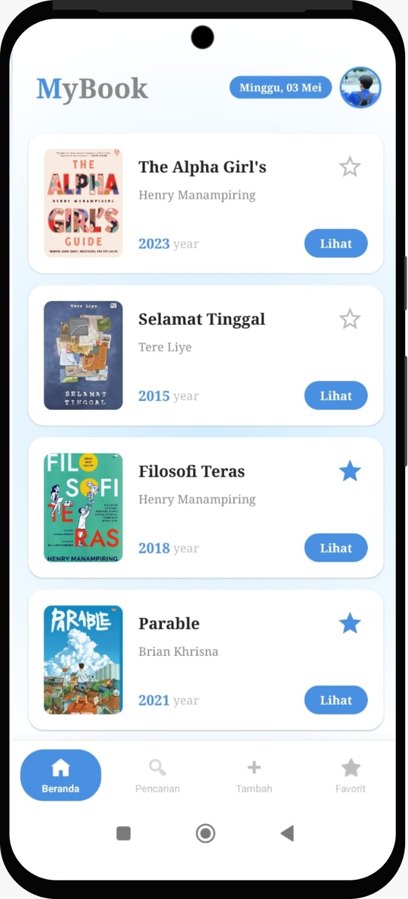
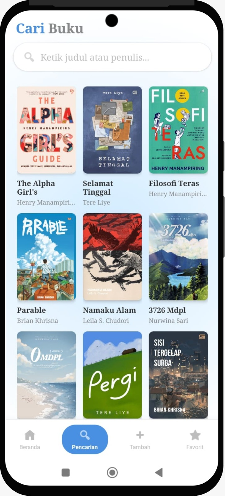
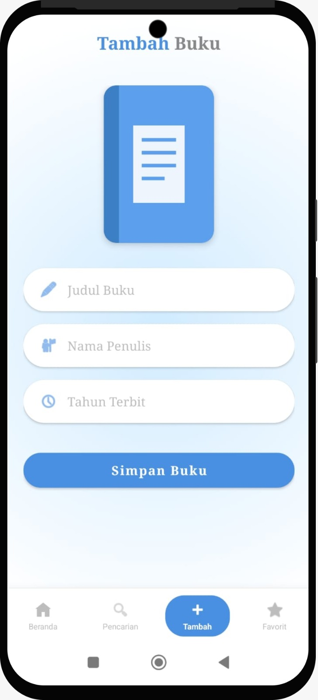
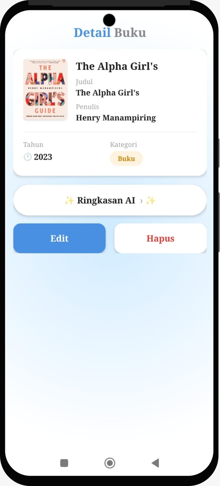
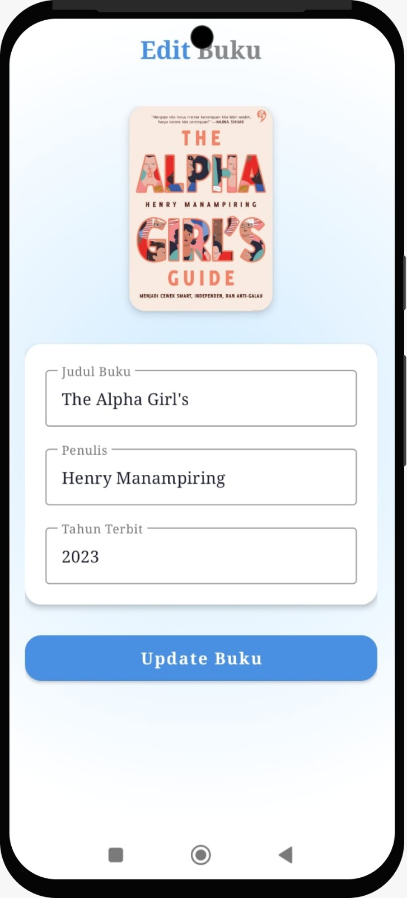
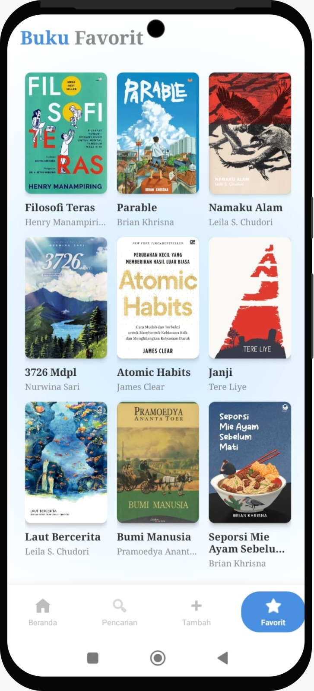
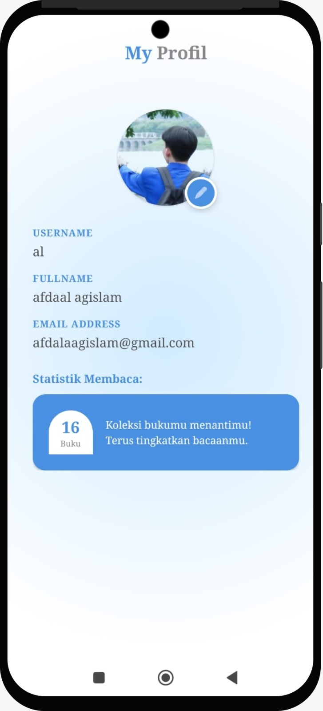

# MyBook - Aplikasi Manajemen Koleksi Buku 📚
Proyek ini dibuat untuk memenuhi tugas Ujian Tengah Semester (UTS) pada mata kuliah Pemrograman Mobile 2. Aplikasi ini berfungsi untuk mengelola data koleksi buku pribadi dengan fitur pencarian, favorit, dan integrasi kecerdasan buatan (AI)

| | |
|---|---|
| **Nama** | Afdhal Agislam |
| **NIM** | 312410445 |
| **Kelas** | I241E |

# Fitur Utama Aplikasi
**1.** **Manajemen Data (CRUD)**: Menambah, melihat rincian, mengedit, dan menghapus data buku secara permanen.

**2.** **Pencarian Pintar:** Mencari buku berdasarkan judul atau nama penulis secara real-time.

**3.** **Sistem Favorit:** Menandai buku favorit dengan ikon bintang yang tersimpan di database.

**4.** **Ringkasan AI (Groq API):** Fitur cerdas untuk merangkum isi buku secara otomatis menggunakan Llama 3 API.

**5.** **Navigasi Premium:** Transisi antar layar menggunakan efek Cross-Fade (Dissolve) yang halus sesuai standar aplikasi modern.

**6.** **Penyimpanan Lokal:** Menggunakan SQLite untuk memastikan data tetap tersimpan meskipun aplikasi ditutup.

# Tampilan Antarmuka (UI) 📱
Sesuai instruksi ujian, berikut adalah deskripsi masing-masing tampilan UI dalam aplikasi:

## 1. Halaman Splashscreen

Halaman ini adalah identitas visual pertama yang dilihat pengguna saat aplikasi dijalankan.

## 2. Halaman Beranda (Home)

Halaman ini adalah antarmuka utama yang menampilkan daftar seluruh koleksi buku yang tersimpan di database SQLite.

**Fitur pada halaman ini:**
*   **Daftar Buku Terstruktur**: Menampilkan informasi Judul, Penulis, dan Tahun terbit menggunakan komponen `RecyclerView` agar responsif[cite: 1].
*   **Status Favorit**: Pengguna dapat langsung menandai buku sebagai favorit melalui ikon bintang di setiap item list[cite: 1].
*   **Navigasi Detail**: Tombol "Lihat" yang mengarahkan pengguna ke rincian buku dengan transisi *cross-fade* yang halus.
*   **Bottom Navigation**: Akses cepat menuju fitur Pencarian, Tambah Buku, dan Koleksi Favorit[cite: 1].

## 3. Halaman Pencarian (Search)

Halaman ini menyediakan fitur pencarian dinamis untuk membantu pengguna menemukan buku tertentu di dalam koleksi secara cepat.

**Fitur pada halaman ini:**
*   **Pencarian Real-time**: Daftar buku akan otomatis terfilter saat pengguna mulai mengetikkan kata kunci tanpa perlu menekan tombol cari[cite: 1].
*   **Filter Ganda**: Pengguna dapat mencari berdasarkan Judul Buku maupun nama Penulis[cite: 1].
*   **State Kosong (Empty State)**: Dilengkapi dengan teks peringatan jika hasil pencarian tidak ditemukan di dalam database[cite: 1].
*   **Integrasi Navigasi**: Menu pencarian dapat diakses secara instan melalui Bottom Navigation Bar dengan efek transisi yang konsisten[cite: 1].

## 4. Halaman Tambah Buku

Halaman ini berfungsi sebagai formulir input bagi pengguna untuk menambahkan koleksi buku baru ke dalam database.

**Fitur pada halaman ini:**
*   **Input Data Lengkap**: Menyediakan field untuk Judul Buku, Nama Penulis, dan Tahun Terbit.
*   **Pemilih Gambar (Image Picker)**: Terintegrasi dengan galeri perangkat untuk memilih sampul buku secara kustom[cite: 1].
*   **Validasi Input**: Memastikan tahun terbit terdiri dari 4 digit dan field utama tidak boleh kosong sebelum disimpan.
*   **Penyimpanan Instan**: Data yang disimpan langsung masuk ke SQLite dan pengguna akan diarahkan kembali ke Beranda dengan efek transisi halus.

---

## 5. Halaman Detail & Ringkasan AI

Halaman ini menampilkan informasi mendalam mengenai buku yang dipilih, serta fitur unggulan integrasi kecerdasan buatan[cite: 1].

**Fitur pada halaman ini:**
*   **Integrasi Groq API (AI)**: Menghasilkan ringkasan buku secara otomatis menggunakan model Llama 3 untuk membantu pengguna memahami isi buku dengan cepat[cite: 1].
*   **Informasi Detail**: Menampilkan sampul buku dalam resolusi HD, judul, penulis, dan tahun terbit secara lengkap[cite: 1].
*   **Manajemen Koleksi**: Akses langsung untuk menghapus buku (Delete) atau masuk ke halaman pembaruan data (Edit)[cite: 1].
*   **Loading State**: Dilengkapi dengan progress bar saat sistem sedang memproses ringkasan dari server AI.

## 6. Halaman Edit Buku

Halaman ini digunakan untuk memperbarui informasi buku yang sudah ada di dalam koleksi.

**Fitur pada halaman ini:**
*   **Auto-Fill Data**: Saat dibuka, formulir akan otomatis terisi dengan data terbaru dari database berdasarkan ID buku.
*   **Pembaruan Sampul**: Pengguna tetap dapat mengubah gambar sampul buku melalui galeri jika diperlukan.
*   **Logika Navigasi Pintar**: Setelah data berhasil diperbarui, aplikasi akan langsung diarahkan kembali ke Beranda (Home) menggunakan `FLAG_ACTIVITY_CLEAR_TOP` untuk menjaga alur navigasi tetap bersih.
*   **Transisi Smooth**: Perpindahan halaman menggunakan efek *cross-fade* agar pengalaman pengguna terasa mulus[cite: 1].

---

## 7. Halaman Buku Favorit

Halaman ini menampilkan kurasi buku-buku yang telah ditandai sebagai favorit oleh pengguna[cite: 1].

**Fitur pada halaman ini:**
*   **Tampilan Grid**: Menggunakan `GridLayoutManager` untuk menampilkan koleksi dalam format 3 kolom yang rapi dan estetik[cite: 1].
*   **Filter Otomatis**: Hanya menampilkan data buku yang memiliki status `is_favorite = 1` di dalam database SQLite[cite: 1].
*   **Sinkronisasi Real-time**: Jika status favorit dicabut melalui halaman Detail, daftar di halaman ini akan otomatis diperbarui[cite: 1].
*   **Empty State**: Menampilkan ilustrasi dan teks jika pengguna belum memiliki buku favorit sama sekali[cite: 1].

---

## 8. Halaman Profil Pengguna

Halaman ini berisi informasi identitas pengguna atau pengembang aplikasi sebagai bagian dari personalisasi[cite: 1].

**Fitur pada halaman ini:**
*   **Informasi Identitas**: Menampilkan Foto Profil, Nama Lengkap, dan Email pengguna[cite: 1].
*   **Statistik Membaca**: Terdapat kartu informasi yang menunjukkan ringkasan aktivitas pengguna di dalam aplikasi[cite: 1].
*   **Desain Modern**: Menggunakan elemen `CardView` dan `CircleImageView` untuk tampilan yang lebih profesional dan bersih[cite: 1].
*   **Akses Navigasi**: Dapat diakses dengan mudah melalui profil ikon di bagian atas halaman utama[cite: 1].

